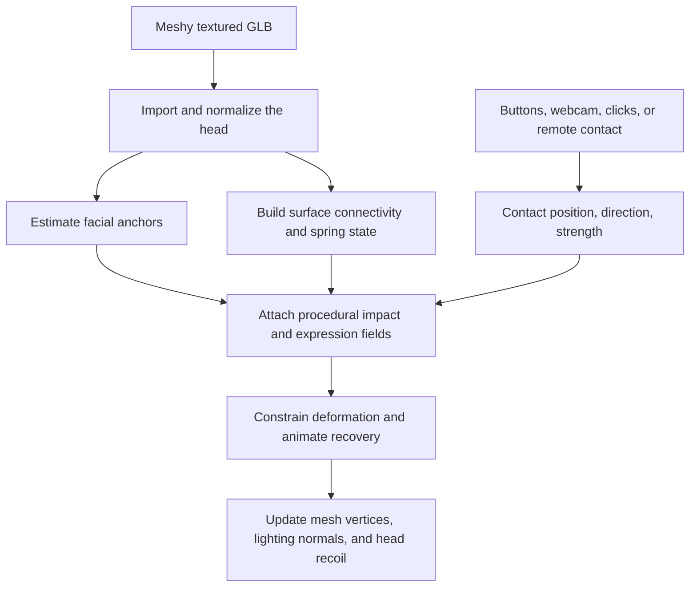

# How the Meshy model becomes interactive

This document describes the implementation in the repository as of September 19, 2026. Meshy supplies the textured 3D head. Our browser code makes that head react
to punches, facial controls, and speech by attaching a **procedural surface rig**:
code that decides how each vertex should move around estimated facial landmarks.
The interaction does not require a bone skeleton, painted skin weights, or
pre-authored animations in the downloaded model.

For a Meshy import, the active dynamics are **local preview springs plus the
facial impact rig**. The separate Newton physics integration is used by the local
reconstruction workflow when its fitted cage is available; importing a Meshy GLB
does not create that cage or attach Newton automatically.



1. **Load the Meshy asset into the existing interaction scene.**

   The saved-scan Meshy workflow in
   [src/meshy-engine.js](../src/meshy-engine.js) fetches the downloaded GLB through
   `/api/meshy-asset`. Its `importGLB()` function passes those bytes to the same
   `#face-file` input used for an uploaded head. This lets Meshy models use the
   app's existing controls and render loop.

   The import handler in [src/main.js](../src/main.js) parses the GLB with
   Three.js `GLTFLoader`, chooses the dominant mesh by triangle count, clones its
   geometry, converts interleaved attributes to packed arrays, and applies its
   world transform. Meshes explicitly tagged as hair or eyeglasses are excluded
   from face selection. The chosen surface retains its imported material and
   texture. This is currently a single-surface interaction path; arbitrary extra
   Meshy submeshes are not automatically assembled into a complete character rig.

2. **Put the head into a consistent coordinate system.**

   `normalizeHead()` centers the geometry on its bounding box and uniformly scales
   its total bounding-box height to **0.28 metres**. The expected orientation is
   **Y up, face toward +Z**. Uniform scaling keeps the shape's proportions while
   giving the contact and deformation code a predictable size to work with.

   This normalization is an application convention, not a measurement of the
   person's head. It does not automatically correct an incorrectly rotated model.
   A bust with large shoulders can also distort the inferred scale. The current
   path preserves the imported surface instead of invoking the old `sliceBust()`
   helper, whose cropping could cut across the chin.

3. **Locate the facial regions that drive the rig.**

   An arbitrary Meshy mesh has no guaranteed facial vertex ordering.
   `detectAnchors()` therefore estimates landmarks from its geometry: it searches
   for the forward-most nose candidate in a restricted height band, finds a low
   front-facing chin candidate near the midline, and uses those positions and
   nearby surface width to estimate cheeks, eyes, lips, and mouth corners.

   The resulting positions use familiar landmark IDs as semantic labels:

   | IDs          | Region            | Purpose                              |
   | ------------ | ----------------- | ------------------------------------ |
   | `1`          | Nose tip          | Frontal contact and nose support     |
   | `152`        | Chin              | Jaw motion and uppercut targeting    |
   | `50`, `280`  | Cheeks            | Hook targeting and cheek deformation |
   | `13`, `14`   | Upper/lower lip   | Mouth location and lower-face scale  |
   | `61`, `291`  | Mouth corners     | Mouth pull and speech shapes         |
   | `159`, `386` | Upper-eye regions | Eyelid squeeze and facial reaction   |

   These IDs do **not** mean that Meshy vertex 152 is the chin. They are keys in
   an anchor-position table. On the normal GLB import path, the table is passed
   to both `dynamics.impactRig.setAnchors()` and
   `dynamics.speechRig.setAnchors()`. The impact fields adapt to those positions
   without requiring Meshy to generate a particular topology.

4. **Attach motion to the actual mesh vertices.**

   `installMesh()` creates a `FaceDynamics` instance from
   [src/physics.js](../src/physics.js). It stores the original and editable rest
   positions, allocates per-vertex offsets and velocities, and builds neighbor
   lists from the triangles. Low-resolution imports below 4,000 positions are
   subdivided twice to give deformation more vertices to work with.

   The preview spring system pulls displaced vertices toward their posed rest
   positions, damps their velocity, and couples neighboring offsets. This gives
   an impact a moving surface and recovery instead of an instantaneous pose
   change. Its stiffness values are heuristic animation settings.

   Alongside those springs, [src/tissue-field.js](../src/tissue-field.js) builds
   a surface graph. Coincident vertices at texture seams share a graph node, and
   contact influence spreads by distance along connected triangle edges. The
   impact field is then copied back to each seam vertex. This helps the impact
   layer remain continuous while retaining the UV coordinates needed by the
   original texture.

5. **Turn a contact into a coordinated facial response.**

   Every accepted contact supplies a location, incoming direction, and strength.
   [src/impact-rig.js](../src/impact-rig.js) finds the nearest connected surface
   vertex and rejects a contact more than 45 mm from the current surface.
   The tissue field separates inward indentation, sideways skin motion, and a
   raised rim around the contact. Anchor-based weights make cheeks and lips more
   mobile than estimated firm regions such as the nose bridge and skull.

   Direction-sensitive correctives carry a cheek strike into the mouth and jaw,
   or an upward chin strike into broader lower-face movement. An additional
   authored reaction in [src/pain-expression.js](../src/pain-expression.js)
   tightens the eyelids, lowers the brows, changes the mouth corners, and releases
   the jaw. These are designed animation responses, not measured muscles or an
   estimate of the person's pain.

   [src/deformation-gradient.js](../src/deformation-gradient.js) refines the
   proposed motion by limiting local triangle stretch and reconstructing a
   connected displacement field. Further displacement and triangle-orientation
   constraints reduce extreme folds and collapsed faces. This geometric stage
   is NFR-inspired; it does not run pretrained NFR neural inference. The detailed
   method and attribution are in [NFR_RIG.md](NFR_RIG.md).

6. **Connect user input to that shared response.**

   The hook buttons and **Q/E** use [src/demo-punch.js](../src/demo-punch.js) to
   choose a surface point near a cheek anchor and fire one contact during the
   hand animation. The uppercut targets the chin. Webcam interaction uses a
   palm-approach detector, with an additional calibrated hand-contact path that
   checks movement against the head bounds and actual mesh. Click-to-punch,
   remote punches, and the public `window.__punchingFace.applyImpact()` interface
   also feed the same dynamics.

   The rig therefore does not need separate animations for every input device.
   Each input describes a contact, and the loaded head supplies the surface and
   anchors that determine the response. The normalized contact API is documented
   in [IMPACT_RIG.md](IMPACT_RIG.md).

7. **Compose and render the motion over time.**

   The preview dynamics combine four layers for each displayed vertex:

   ```text
   displayed position = editable rest position
                      + manual expression offset
                      + spring offset
                      + impact offset, including retained dents
                      + speech offset
   ```

   The renderer marks the position buffer for upload and periodically recomputes
   normals so lighting follows the deformed surface. The existing UVs keep the
   Meshy texture attached to its triangles. Head recoil is a separate rotation
   of `headPivot`, driven by contact position and direction.

   In live mode, contact compression peaks around 120 ms of simulation time and
   recovers; the authored wince can last about 1.65 seconds. Normal-strength hits
   are elastic. Explicit magnitudes above 0.90 can retain bounded displacement;
   clay mode retains the contact deformation. Hold peak pauses the visible pose,
   release resumes playback, and reset clears impact deformation. These timings,
   thresholds, and limits are animation choices.

The imported head also receives the existing jaw, smile, brow, and squint
controls. These manual controls use fixed heuristic coordinate fields; they are
less adaptive than the anchor-fitted impact and speech layers. GLB export creates
four expression morph targets and bakes committed dents into the exported rest
geometry. The browser's interactive contact solver itself is not embedded as a
portable skeletal animation in the exported GLB.

For speech on the saved-scan/upload path, `fitMouth()` renders the imported head,
runs facial landmark detection on that image, and raycasts the detected points
back onto the surface. [src/lip-detect.js](../src/lip-detect.js) supplies those
positions to the speech rig; [src/mouth-aperture.js](../src/mouth-aperture.js)
attempts to open the sealed mouth and add a dark interior.
[src/speech-rig.js](../src/speech-rig.js) blends precomputed opening, spreading,
and rounding shapes from the speech signal. Speech movement is reduced during
an impact so the two responses remain readable. If fitting fails, the mouth
can remain sealed and its motion reads as surface stretching. This detector
updates speech anchors; it does not replace the impact rig's geometric anchors.

There is one implementation difference to keep in mind: the older **Photo → 3D
self** checkbox calls `loadMeshyGLB()` directly. It normalizes the head and fits
impact anchors, but does not explicitly perform the saved-scan import path's
speech re-anchoring and `fitMouth()` step. Both paths support impact interaction;
their mouth setup is not identical.

Automatic fitting remains approximate. Hair, glasses, unusual proportions,
orientation, and disconnected geometry can mislead anchor detection or produce
poor deformation. The spring and surface constraints do not provide a fitted
internal skull, anatomical tissue simulation, or a guarantee against every
self-intersection. The original Meshy geometry and texture determine the likeness.

This explanation was checked against the current source. Existing tests cover
[Meshy import hooks](../tests/meshy-engine-hook.test.mjs),
[facial impact behavior](../tests/impact-rig.test.mjs),
[directional contacts and retained dents](../tests/directional-impact.test.mjs),
[gradient reconstruction](../tests/deformation-gradient.test.mjs), and
[speech shapes](../tests/speech-rig.test.mjs). Those tests describe component
coverage; this documentation change does not establish new visual validation of
a particular Meshy asset.
